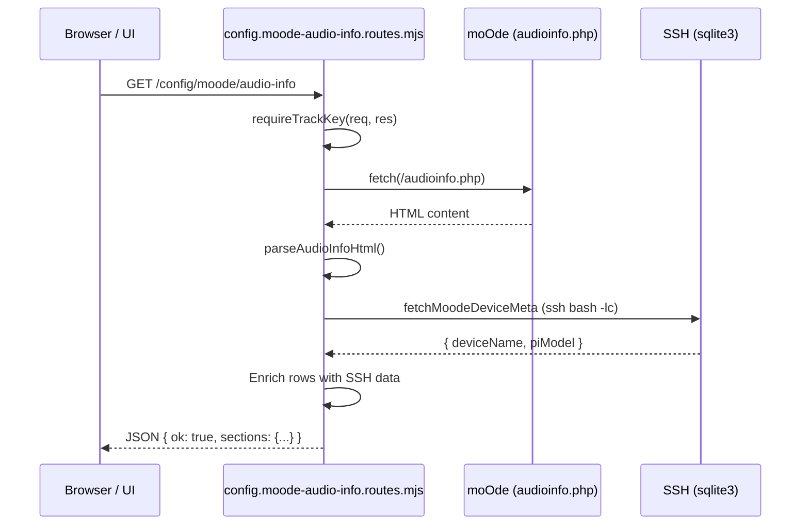

# API Extension

<details>
<summary>Relevant source files</summary>

The following files were used as context for generating this wiki page:

- [ARCHITECTURE.md](ARCHITECTURE.md)
- [INSTALLER_PLAN.md](INSTALLER_PLAN.md)
- [TESTING_CHECKLIST.md](TESTING_CHECKLIST.md)
- [URL_POLICY.md](URL_POLICY.md)
- [moode-nowplaying-api.mjs](moode-nowplaying-api.mjs)
- [scripts/index.js](scripts/index.js)
- [src/lib/exec.mjs](src/lib/exec.mjs)
- [src/lib/log.mjs](src/lib/log.mjs)
- [src/routes/config.moode-audio-info.routes.mjs](src/routes/config.moode-audio-info.routes.mjs)
- [src/routes/config.routes.index.mjs](src/routes/config.routes.index.mjs)
- [src/routes/track.routes.mjs](src/routes/track.routes.mjs)
- [src/services/mpd.service.mjs](src/services/mpd.service.mjs)

</details>


This page provides a guide for extending the now-playing API. It covers the modular route registration pattern, dependency injection for core services, authentication guards, and the URL policy for maintaining stable endpoints.

## API Architecture Overview

The backend is built on an Express-based modular architecture. Instead of a monolithic route file, the system uses functional route modules that are registered via a central index.

### One-Line Model
*   **API node = data + control** (JSON, metadata logic, art generation, queue/rating endpoints) [ARCHITECTURE.md:7-7]()
*   **Web/UI node = pixels** (HTML/JS pages) [ARCHITECTURE.md:8-8]()

### Default Ports
*   **API:** `3101` [ARCHITECTURE.md:14-14]()
*   **Web/UI:** `8101` [ARCHITECTURE.md:15-15]()

**Diagram: API Route Registration Flow**

```mermaid
graph TD
    subgraph "Entry Point"
        [moode-nowplaying-api.mjs]
    end

    subgraph "Aggregation Layer"
        [src/routes/config.routes.index.mjs] -- "registerAllConfigRoutes()" --> Registry["Route Registry"]
    end

    subgraph "Feature Modules"
        Registry --> [config.queue-wizard-preview.routes.mjs]
        Registry --> [config.library-health-art.routes.mjs]
        Registry --> [config.browse.routes.mjs]
        Registry --> [config.moode-audio-info.routes.mjs]
    end

    subgraph "Data Services"
        [src/services/mpd.service.mjs] -- "mpdQueryRaw()" --> MPD["MPD Socket"]
        [src/lib/browse-index.mjs] -- "getBrowseIndex()" --> Cache["Library Cache"]
    end

    [moode-nowplaying-api.mjs] --> [src/routes/config.routes.index.mjs]
    [config.queue-wizard-preview.routes.mjs] --> Cache
    [config.library-health-art.routes.mjs] --> MPD
```
**Sources:** [src/routes/config.routes.index.mjs:21-116](), [ARCHITECTURE.md:44-46](), [moode-nowplaying-api.mjs:1-19]()

---

## Implementing New Routes

### The `registerAllConfigRoutes` Pattern
New configuration and management routes should be added to `src/routes/config.routes.index.mjs`. This function acts as a dependency injector, passing core utilities like `requireTrackKey` and `getRatingForFile` to individual modules.

**Example Registration:**
```javascript
// src/routes/config.routes.index.mjs
export function registerAllConfigRoutes(app, deps) {
  registerConfigMyNewFeatureRoutes(app, {
    requireTrackKey: deps.requireTrackKey,
    getRatingForFile: deps.getRatingForFile,
  });
}
```
**Sources:** [src/routes/config.routes.index.mjs:21-42]()

### Dependency Injection
Route modules do not import global state. Instead, they receive a `deps` object containing:
*   `requireTrackKey`: Authentication middleware [src/routes/config.routes.index.mjs:23-23]()
*   `getRatingForFile`: Helper to fetch MPD sticker ratings [src/routes/config.routes.index.mjs:28-28]()
*   `setRatingForFile`: Helper to update ratings [src/routes/config.routes.index.mjs:47-47]()
*   `mpdQueryRaw`: Direct socket communication with MPD [src/routes/config.routes.index.mjs:86-86]()
*   `log`: Shared logging utility [src/routes/config.routes.index.mjs:59-59]()

---

## Authentication & Guards

### `requireTrackKey`
Most management endpoints require the `x-track-key` header or `k` query parameter. This is enforced by calling `requireTrackKey(req, res)` at the start of the route handler. If the key is missing or invalid, the function sends a `403` response and returns `false`.

```javascript
// Example from moode-audio-info routes
app.get('/config/moode/audio-info', async (req, res) => {
  if (!requireTrackKey(req, res)) return; // Guard clause
  // ... logic
});
```
**Sources:** [src/routes/config.moode-audio-info.routes.mjs:79-81](), [src/routes/track.routes.mjs:123-123]()

---

## Metadata & Radio Handling

The API includes specialized logic for radio metadata, including a "holdback" policy to prevent rapid UI flickering when stations send messy metadata updates.

### Radio Metadata Holdback
The `applyRadioMetadataHoldback` function uses a `Map` to track stable vs. pending metadata signatures. This ensures that a new track title is only promoted to the UI after it has been "stable" for a configured duration (e.g., 6000ms for classical stations).

**Logic Flow:**
1.  Check `radioHoldbackPolicy` for the station (e.g., `wfmt`, `kusc` are marked 'strict') [moode-nowplaying-api.mjs:59-69]().
2.  If the metadata signature changes, it is placed in a `pending` state [moode-nowplaying-api.mjs:113-118]().
3.  Promotion occurs if `pendingAgeMs >= holdbackMs` or if a stream reset is detected via `elapsedSec` [moode-nowplaying-api.mjs:120-124]().

**Sources:** [moode-nowplaying-api.mjs:71-158]()

---

## URL Policy & Stability

To ensure third-party integrations and kiosk displays remain functional, the project adheres to a strict URL policy defined in `URL_POLICY.md`.

### Canonical Endpoint Naming
*   **UI Routes:** `/app.html`, `/index.html`, `/display.html` [URL_POLICY.md:9-12]()
*   **API Base:** Defaults to port `3101` [URL_POLICY.md:56-56]()
*   **Art Routes:** `/art/current.jpg`, `/art/current_bg_640_blur.jpg` [URL_POLICY.md:45-47]()

### Extension Rules
1.  **Announce First:** Add new canonical URLs before deprecating old ones [URL_POLICY.md:63-63]()
2.  **Compatibility Aliases:** Keep old endpoints as redirects for at least one release cycle [URL_POLICY.md:64-64]()
3.  **No Breaking Changes:** Avoid removing aliases until known clients (like the Alexa skill or hardware kiosks) are migrated [URL_POLICY.md:66-66]()

---

## Data Flow: Audio Info Example

The following diagram illustrates the data flow when fetching enriched audio information from a moOde device.

**Diagram: Audio Info Enrichment Flow**


**Sources:** [src/routes/config.moode-audio-info.routes.mjs:76-140](), [src/routes/config.moode-audio-info.routes.mjs:34-49]()

### Key logic in `fetchMoodeDeviceMeta`:
This function uses `ssh` with `BatchMode=yes` to query the moOde SQLite database directly for the `adevname` (audio device name) and reads `/proc/device-tree/model` to determine the Raspberry Pi hardware version. [src/routes/config.moode-audio-info.routes.mjs:34-49]()
