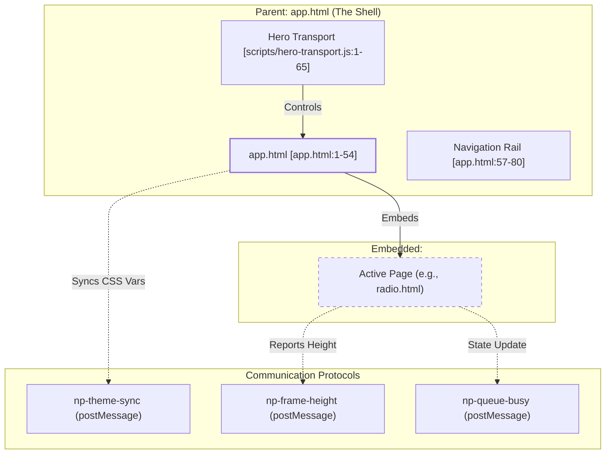
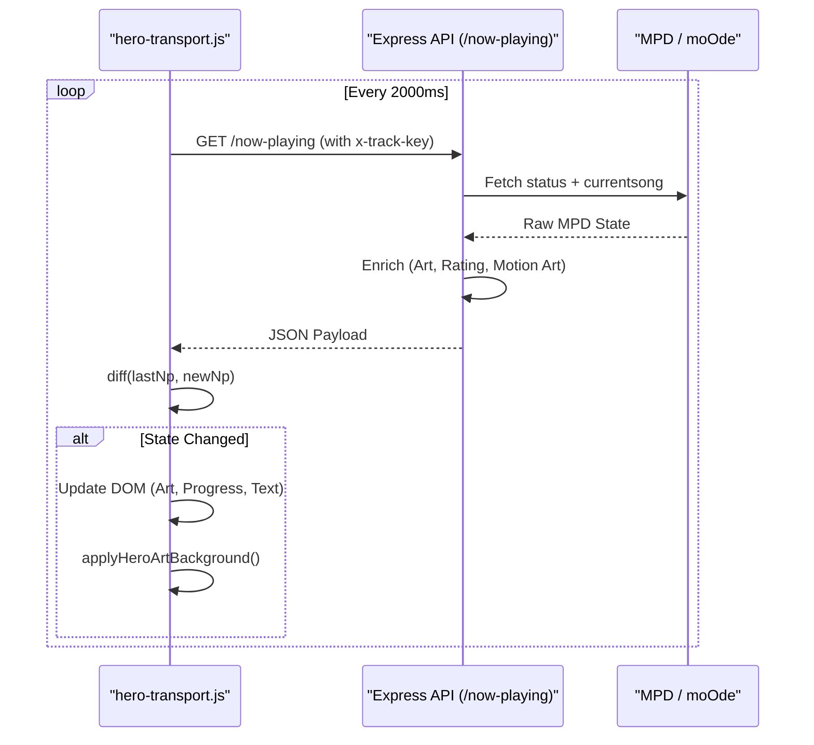

# UI Component Patterns

<details>
<summary>Relevant source files</summary>

The following files were used as context for generating this wiki page:

- [alexa.html](alexa.html)
- [app.html](app.html)
- [docs/08-hero-shell.md](docs/08-hero-shell.md)
- [docs/09-index-vs-app.md](docs/09-index-vs-app.md)
- [docs/10-random-vs-shuffle.md](docs/10-random-vs-shuffle.md)
- [peppy.html](peppy.html)
- [radio.html](radio.html)
- [scripts/hero-transport.js](scripts/hero-transport.js)
- [src/routes/config.runtime-admin.routes.mjs](src/routes/config.runtime-admin.routes.mjs)
- [styles/hero.css](styles/hero.css)
- [theme.html](theme.html)

</details>


## Purpose and Scope

This page documents common patterns for extending the UI and integrating components within the "now-playing" ecosystem. It covers the shell-and-frame architecture, the `postMessage` communication protocol for theme and state synchronization, and the behavioral differences between standalone displays (`index.html`) and the application shell (`app.html`).

---

## Application Shell Architecture

The system uses a "Shell-and-Frame" architecture where `app.html` serves as the primary container, embedding specialized functional pages (Config, Queue Wizard, Radio, etc.) via an `<iframe>` while providing a persistent global transport bar (the "Hero Transport").

### Component Relationship Diagram

The following diagram maps the logical UI components to their corresponding code entities and communication channels.

**Title: Shell-and-Frame Entity Mapping**

**Sources:** [app.html:1-54](), [scripts/hero-transport.js:1-65](), [app.html:57-80]()

---

## iframe Integration Patterns

To ensure seamless integration within the shell, embedded pages utilize specific normalization and communication patterns.

### 1. normalizeEmbeddedDoc Pattern
Embedded pages (like `radio.html` or `alexa.html`) use a "Shell Redirect" script to ensure they are always viewed within the context of the `app.html` shell unless explicitly requested as standalone.

**Implementation Example:**
```javascript
(function(){
  const qs = new URLSearchParams(location.search || '');
  if (qs.get('standalone') === '1') return; // Allow standalone mode
  if (window.top !== window.self) return;   // Already in iframe
  
  const file = location.pathname.split('/').pop() || 'index.html';
  const app = new URL('app.html', location.href);
  app.searchParams.set('page', file);
  location.replace(app.toString());
})();
```
**Sources:** [radio.html:6-22](), [alexa.html:6-22]()

### 2. postMessage Protocol
The shell and frames communicate using a structured `postMessage` protocol to synchronize visual state and layout.

| Message Type | Direction | Purpose |
| :--- | :--- | :--- |
| `np-theme-sync` | Parent → Frame | Propagates CSS variable tokens from `theme.html` to the active iframe. |
| `np-frame-height` | Frame → Parent | Reports the internal `scrollHeight` of the iframe content to allow `app.html` to resize the frame without scrollbars. |
| `np-queue-busy` | Frame → Parent | Signals the Hero Transport to show a loading spinner (e.g., during queue generation). |

**Sources:** [app.html:200-250](), [theme.html:120-150]()

---

## Hero Transport Integration

The "Hero Transport" is a unified playback control surface defined in `scripts/hero-transport.js`. It is shared between `index.html` (Desktop Display) and `app.html` (App Shell).

### Data Flow: Polling and Enrichment
The Hero Transport implements a "Poll-and-Diff" model to maintain UI state without constant full-page refreshes.

**Title: Hero Transport Data Pipeline**

**Sources:** [scripts/hero-transport.js:65-127](), [scripts/hero-transport.js:423-450]()

### Key Functions
- `applyHeroArtBackground(trackKey, artSource)`: Dynamically updates the background of the transport area with a blurred version of the current album art [scripts/hero-transport.js:65-85]().
- `ensureRuntimeKey(force)`: Fetches the required `trackKey` from `/config/runtime` to authorize playback commands [scripts/hero-transport.js:92-103]().
- `playback(action, key, payload)`: Proxies transport commands (play, pause, skip) to the `/config/diagnostics/playback` endpoint [scripts/hero-transport.js:105-114]().

---

## Behavioral Differences: index.html vs app.html

While both pages display "Now Playing" information, they serve different architectural roles.

| Feature | `index.html` (Desktop Display) | `app.html` (App Shell) |
| :--- | :--- | :--- |
| **Primary Goal** | Full-screen visual experience. | Management and navigation shell. |
| **Layout** | Responsive grid with motion art focus. | Navigation rail with embedded iframes. |
| **State** | Direct poll-and-render. | Parent-child coordination via `postMessage`. |
| **Styling** | Direct CSS overrides. | Token-based theming via `theme.html`. |

### Responsive Overrides
The system uses `styles/hero.css` to manage transport layouts across different widths, ensuring the Hero Transport remains functional on devices from 700px to 1201px+ [styles/hero.css:7-61]().

**Sources:** [docs/09-index-vs-app.md:1-17](), [styles/hero.css:1-62]()

---

## Theme Synchronization

The system utilizes a CSS Variable-based theming engine. Tokens are managed in `theme.html` and persisted in `localStorage` under `nowplaying.themeTokens.v1`.

### Implementation Detail
When a theme is updated in the editor, it broadcasts the change to the shell. The shell then iterates through all `document.documentElement.style` properties to apply the new tokens and forwards them to the active iframe [theme.html:57-80](), [app.html:24-49]().

**Sources:** [theme.html:57-80](), [app.html:24-49](), [theme.html:84-108]()
