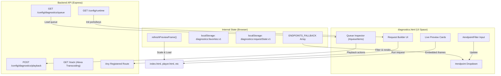
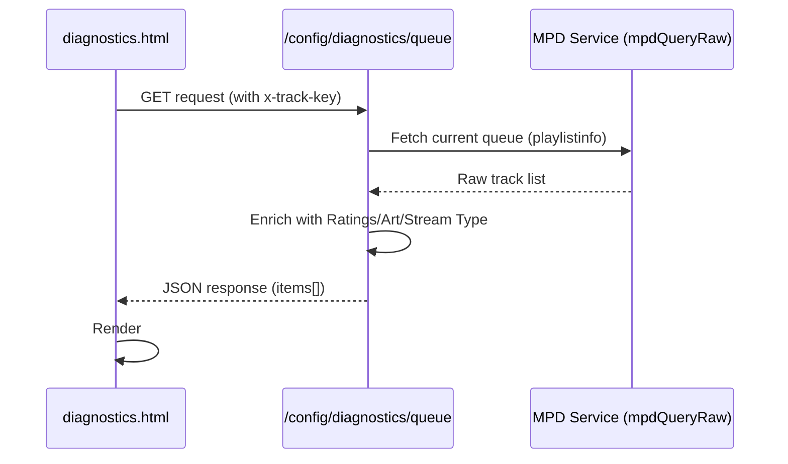

# Testing & Debugging

Relevant source files

The following files were used as context for generating this wiki page:

- [ARCHITECTURE.md](ARCHITECTURE.md)
- [INSTALLER_PLAN.md](INSTALLER_PLAN.md)
- [TESTING_CHECKLIST.md](TESTING_CHECKLIST.md)
- [URL_POLICY.md](URL_POLICY.md)
- [diagnostics.html](diagnostics.html)
- [docs/12-troubleshooting.md](docs/12-troubleshooting.md)
- [scripts/index.js](scripts/index.js)
- [src/routes/track.routes.mjs](src/routes/track.routes.mjs)
- [styles/podcasts.css](styles/podcasts.css)

This page documents the testing and debugging tools available for developers extending or troubleshooting the now-playing system. The primary interface is the **Diagnostics** page ([diagnostics.html]()), which provides endpoint testing, live UI previews, queue inspection, and playback controls.

---

## Overview

The diagnostics system provides three core capabilities:

1.  **API Endpoint Testing** — Execute any API endpoint with custom payloads, view responses, and export as curl commands.
2.  **Live UI Previews** — Embedded iframe previews of all UI pages (`index.html`, `player.html`, `peppy.html`, `controller.html`, `kiosk.html`) with scaling and zoom controls.
3.  **Queue Inspection & Playback Control** — View current queue state with enriched metadata, manipulate tracks, control playback, and test rating operations.

The diagnostics interface is designed for rapid iteration during development and for diagnosing production issues without needing terminal access to the API server.

**Sources:** [diagnostics.html:1-23](), [ARCHITECTURE.md:51-51](), [URL_POLICY.md:31-31]()

---

## Diagnostics Interface Architecture

The diagnostics page is a single-page application that persists state (favorites, filter text, last endpoint, zoom levels, collapsed sections) to `localStorage`. It serves as a central hub for verifying the distributed topology of the system.

### Data Flow & Component Interaction

**Sources:** [diagnostics.html:1-107](), [ARCHITECTURE.md:19-41](), [URL_POLICY.md:54-59]()

---

## Endpoint Testing System

### Endpoint Catalog

The diagnostics page utilizes a curated endpoint catalog. While it attempts to load live routes from the server, it relies on a robust fallback list of common routes including `/now-playing`, `/config/library-health`, and `/podcasts/download-latest`.

| Catalog Source | Purpose | Key Entries |
| :--- | :--- | :--- |
| `ENDPOINTS_FALLBACK` | Provides rapid selection of common routes | `/now-playing`, `/art/current.jpg`, `/config/runtime` |
| Manual Input | Allows testing of new or undocumented routes | Custom Path + Method (GET/POST/PUT/DELETE) |

**Sources:** [URL_POLICY.md:1-67](), [ARCHITECTURE.md:56-65]()

### Request Builder Implementation

The request builder allows constructing HTTP requests with specific controls:

*   **Method Selector:** Automatically shows/hides the JSON body `textarea` based on the selected HTTP verb.
*   **Track Key Toggle:** A checkbox (`#useTrackKey`) determines if the `x-track-key` header is included. This is mandatory for control/config routes.
*   **Body Validation:** JSON is validated before submission; errors are caught and displayed in the `#out` pane.

**Sources:** [diagnostics.html:84-107](), [diagnostics.html:136-176](), [ARCHITECTURE.md:62-65]()

### Response & Export

Responses are displayed in a specialized output pane (`#out`). The system handles multiple content types:
*   **JSON:** Formatted for readability.
*   **Images:** Rendered directly in an `` element (e.g., for testing `/art/current.jpg`).
*   **Curl Export:** Generates a shell-ready command including headers and JSON body for external debugging.

**Sources:** [diagnostics.html:38-38](), [URL_POLICY.md:43-53]()

---

## Live Preview & Scaling Engine

The diagnostics page embeds core UI surfaces as live iframes. To fit large displays (like 1920x1080) into a diagnostic dashboard, it uses a CSS `transform: scale()` engine.

### Viewport Scaling Logic

Each preview card wraps an iframe. The scaling logic calculates the factor based on user input and updates the wrapper dimensions to prevent layout shifting.

| Preview Page | File | Target Resolution | Scale Wrapper ID |
| :--- | :--- | :--- | :--- |
| **Live Display** | `index.html` | 1920x1080 | `#liveFrameScaleWrap` |
| **Player Render** | `player.html` | 1280x400 | `#playerFrameScaleWrap` |
| **Peppy Meter** | `peppy.html` | 1280x400 | `#peppyFrameScaleWrap` |
| **Mobile UI** | `controller.html` | 430x932 | `#mobileFrameScaleWrap` |

**Sources:** [diagnostics.html:179-287](), [URL_POLICY.md:9-15]()

---

## Queue Inspection & Playback Control

The Queue Inspector provides a live view of the MPD queue, enriched with metadata and stream-specific badges.

### Queue Data Flow

**Sources:** [ARCHITECTURE.md:21-25](), [ARCHITECTURE.md:63-63](), [TESTING_CHECKLIST.md:24-24]()

### Key UI Features:
*   **Head Track Highlight:** The currently playing track is visually distinct.
*   **Stream Detection:** Logic identifies Radio, YouTube, and Podcast streams to adjust metadata display.
*   **Optimistic Controls:** Transport buttons (`play`, `pause`, `next`, `prev`) trigger `POST /config/diagnostics/playback` and provide immediate UI feedback.

**Sources:** [diagnostics.html:42-57](), [TESTING_CHECKLIST.md:25-25]()

---

## Testing Checklist & Validation

The codebase includes a formal `TESTING_CHECKLIST.md` used to verify system integrity before releases.

### Core Validation Tiers:
1.  **Boot/Syntax:** Checking API entry points (`moode-nowplaying-api.mjs`) and major JS files.
2.  **API Smoke Tests:** Verifying `/healthz`, `/now-playing`, and artwork routes (`/art/current.jpg`).
3.  **Protected API:** Testing routes requiring `x-track-key` like `/config/diagnostics/playback` and `/config/queue-wizard/apply`.
4.  **UI Verification:** Ensuring `index.html`, `diagnostics.html`, and `library-health.html` render correctly.

**Sources:** [TESTING_CHECKLIST.md:1-58](), [INSTALLER_PLAN.md:7-10]()

---

## Troubleshooting Playbook

Common issues and their diagnostic steps as defined in `docs/12-troubleshooting.md`:

| Issue Class | Symptom | Diagnostic Step |
| :--- | :--- | :--- |
| **Stale Deploy** | UI doesn't match API capabilities | Check `/config/runtime` for version/host info |
| **Cache-Busted Proxy** | 404 on assets/scripts | Verify proxy paths and clear browser cache |
| **UI Parity Drift** | Feature works in `app.html` but not `index.html` | Check shell-and-frame sync logic |
| **Key Issues** | 401/403 errors on POST actions | Verify `x-track-key` in `diagnostics.html` |
| **Transcoding Failure** | Alexa cannot play local track | Test `/track?file=...&t=N` endpoint directly |

### Alexa-Specific Debugging
If Alexa playback fails, verify the transcoding pipeline. The `/track` route handles JIT transcoding of local files to MP3 for Alexa consumption. Use the Diagnostics tool to call `/track` with a local file path and verify the `Content-Type: audio/mpeg` response.

**Sources:** [docs/12-troubleshooting.md:1-14](), [src/routes/track.routes.mjs:106-173](), [TESTING_CHECKLIST.md:37-42]()
